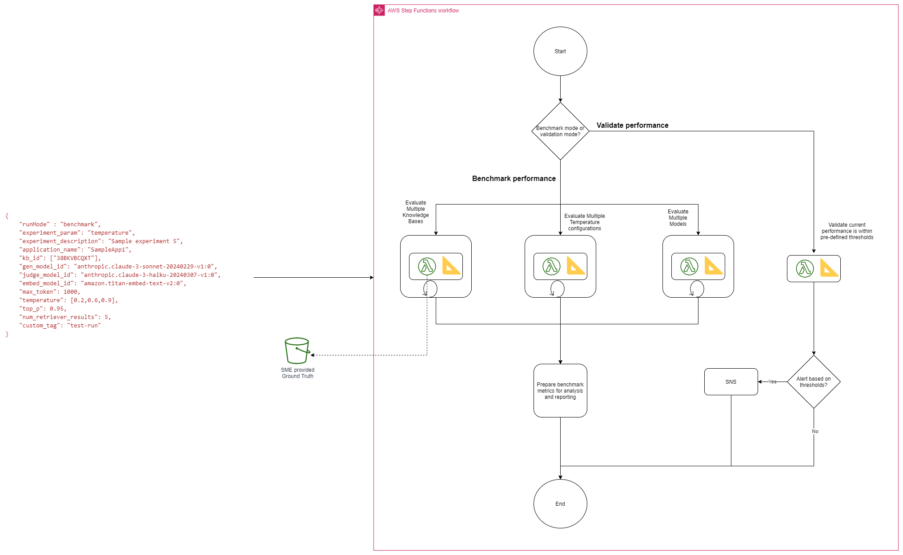
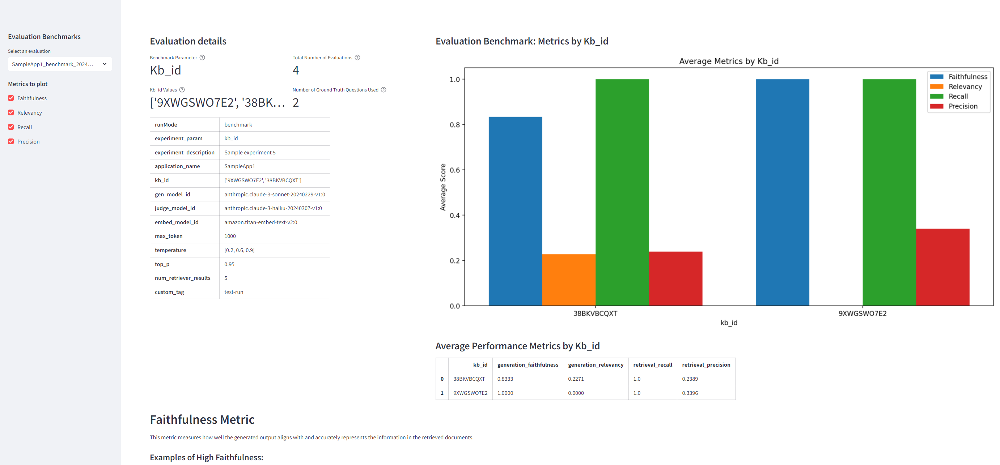

# A framework to evaluate performance of RAG based applications

As enterprises accelerate the adoption of Generative AI from proof-of-concept to production-grade applications, the need for robust evaluation of Retrieval Augmented Generation (RAG) systems becomes increasingly critical.

Code in this repository provides a RAG evaluation solution using the Ragas framework. This solution supports two different evaluation modes. 

1. Benchmark mode facilitates the comparison of multiple RAG configurations against one another. This mode is useful when evaluating the adoption of new configurations, such as testing new language models or updates to chunking strategies. 
2. Validation mode, is used for integration into testing and code promotion pipelines. In this mode, metrics are compared against pre-defined thresholds, allowing for automated decision-making in the promotion of code or configurations to higher environments.

The solutions uses AWS Step Functions to orchestrate the evaluation in both modes. When run in Benchmark mode, multiple configurations such as different temperatures can be evaluated against one another. When run in validation mode, the evaluation metrics are compared against pre-defined thresholds. Metrics from evaluation in both modes are persisted in S3 using Kinesis Firehose. Athena is used to query these metrics for visualization and reporting.

## Evaluation Flow

## Deployment overview
This solution is deployed in 3 stacks
1. The RAG evaluation framework stack. 
1. A sample application stack. This stack contains 1/SSM parameter which defines the threshold metrics for this application, 2/A csv file that has ground truth data 3/A Bedrock Knowledgebase. The data indexed in this KB and the ground truth are synthetic data for a 10K filing of a fictious company
1. A reporting stack. This stack deploys an EC2 instance that runs a streamlit application. This streamlit application provides simple UI to analyze the evaluation metrics for various runs.

## Sample evaluation report

## Deployment steps
1. Deploy the evaluation framework stack - `cdk deploy EvalAppFrameworkStack`
1. Deploy the sample application stack - `cdk deploy SampleAppStack`
1. Create an email subscription for the SNS topic created. Activate the subscription from email.
1. Deploy the reporting stack - `cdk deploy ReportingStack`

## Testing steps
1. Run an evaluation in benchmark mode. Change directory to scripts. `cd scripts` and run `./test_workflow.sh`.
1. TODO

